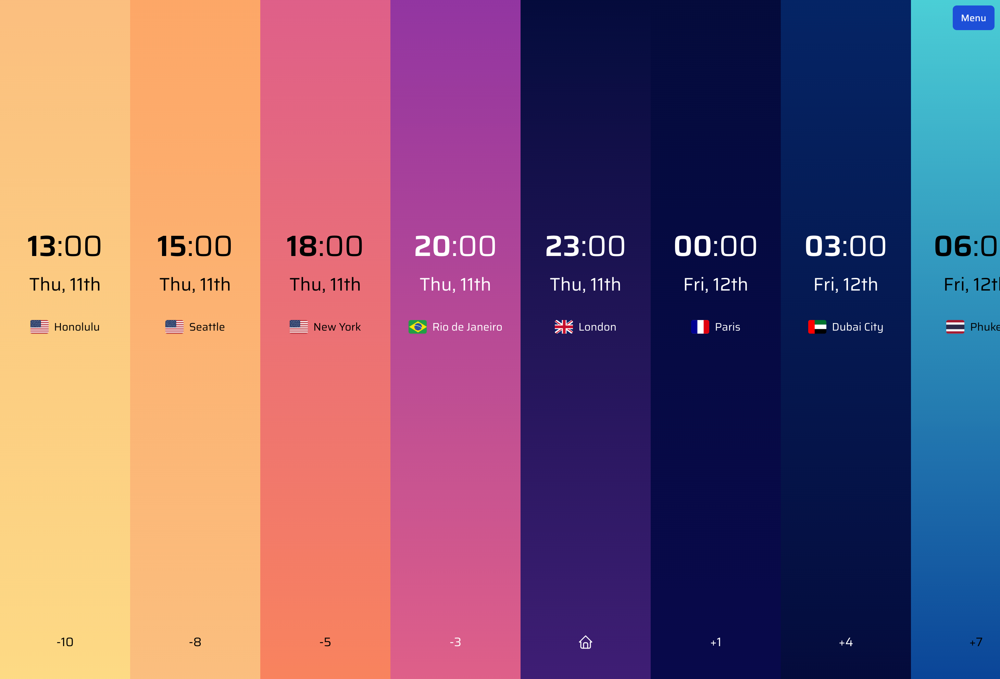
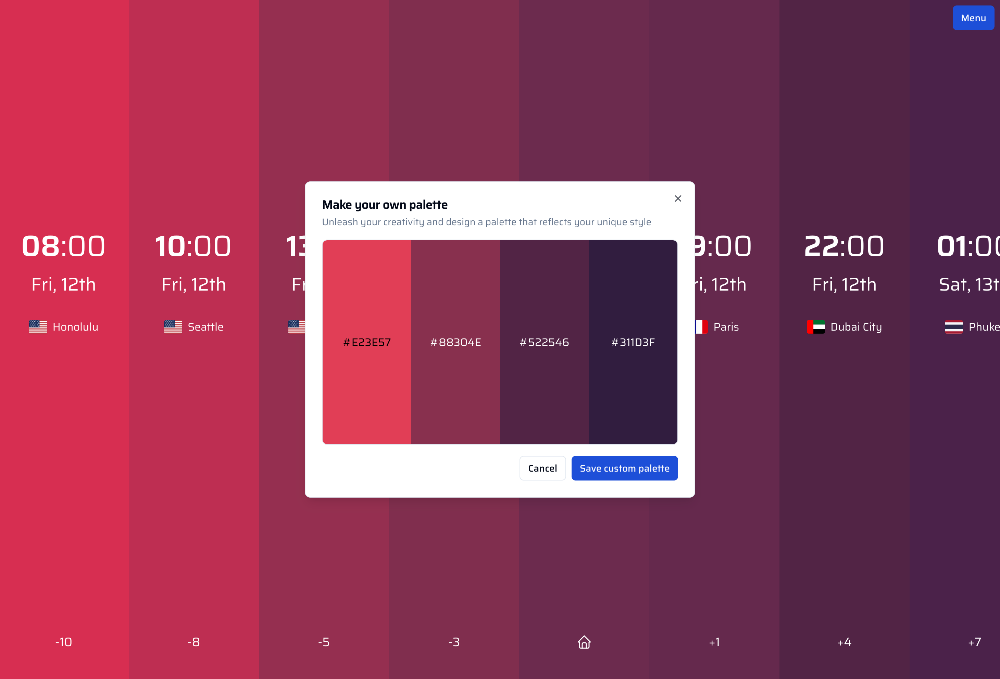

<h1 align="center">
  <div>
    
  </div>
  Epic Zeit
</h1>

***

[![Badge License]][License]

## Introduction

Epic Zeit is a powerful tool designed to simplify your interaction with time zones worldwide. 

It is crafted for anyone who needs to manage international meetings, travel plans, or simply wishes to keep track of time around the world.

## Look and Feel

<p align="left">
  
  
  
</p>


## Prerequisites
- [Node.js](https://docs.npmjs.com/getting-started/installing-node) _(^18.0.0)_
- [pnpm](https://pnpm.io/installation) _(^8.7.0)_


## Apps and Packages

This Turborepo monorepo includes the following packages/apps:

- `web`: a [Vite](https://vitejs.dev/) app
- `extension`: a Chrome extension / Firefox addon 
- `@repo/ui`: a React component library shared by both `web` and `extension` applications

## Build

To build all apps and packages, run the following command:

```
pnpm run build
```

## Develop

To develop all apps and packages, run the following command:

```
pnpm run dev
```

or you can individually start a web app:
```
cd apps/web
pnpm run dev
```


## License

Epic Zeit is made available under the [GPLv3 License][License]


<!----------------------------------------------------------------------------->

[License]: LICENSE.txt

[Badge License]: https://img.shields.io/badge/License-GPLv3-blue.svg
